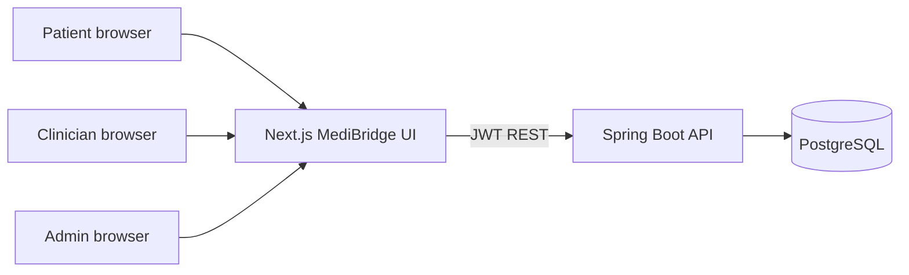

# MediBridge — Architecture

## Problem

Appointment tools store visit times. They rarely tell a patient **who later opened their file**. Consent is assumed. Care notes leak into patient-facing screens.

MediBridge is **coordination software**, not a medical device and not a doctor. The memorable capability is the pair **`PrivacyGuard` + `AccessAuditService`**: accessing a patient record writes an audit row, and a clinician cannot read care notes without an active consent.

## Who uses it

| Role | Job to be done |
| --- | --- |
| `PATIENT` | Self-register, book/cancel visits, grant/revoke consent, read their access timeline |
| `CLINICIAN` | Publish availability, see today's visits, write private notes **only with consent** |
| `ADMIN` | Facilities, user enablement, operational counts |

## System context

## Backend modules

| Module | Responsibility |
| --- | --- |
| `security` | Registration, login, JWT, role checks |
| `PrivacyGuard` | Consent gate for notes and patient-record access |
| `AccessAuditService` | Mandatory log of PHI-adjacent reads/writes (no note bodies) |
| `scheduling` | Facilities, slots, book, cancel |
| `consent` | Grant and revoke clinician access |
| `notes` | Clinician-only care text |
| `notify` | In-app alerts |
| `admin` | Users and facilities |

## Frontend map

| Route | Audience |
| --- | --- |
| `/login`, `/register` | Public |
| `/dashboard` | Patient home |
| `/book`, `/appointments` | Patient / clinician visits |
| `/consent` | Patient |
| `/audit` | Patient own; clinician with consent; admin all |
| `/notifications` | All authenticated |
| `/clinician` | Clinician |
| `/admin` | Admin |

## Authentication and authorization

- Passwords hashed with BCrypt.
- Access JWT (HMAC) in `Authorization: Bearer`. Logout bumps `token_version`.
- Method security: `@PreAuthorize` on controllers.
- CORS restricted to `http://localhost:3004` by default.
- Rate limit on login.
- Validation on every write DTO.

## Persistence

PostgreSQL is the production database (Flyway `V1__init.sql`). A `local` profile uses H2 in PostgreSQL compatibility mode so the API can be demonstrated without Docker.

## Trade-offs

| Decision | Why | Cost |
| --- | --- | --- |
| Consent per clinician | Clear, testable gate | No facility-wide consent in v1 |
| Notes never patient-visible | Reduces accidental PHI on the wrong screen | Patients must ask the clinician in person |
| Audit without note bodies | Minimizes sensitive text in the log | Timeline is operational, not a transcript |
| JWT without refresh rotation v1 | Smaller security surface | Short access TTL required |

## Production follow-ups

TLS at the proxy, `SEED_DEMO_DATA=false`, rotate `JWT_SECRET`, disable H2 console.
