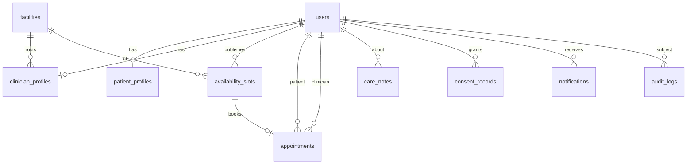

# MediBridge — Database

Production database: **PostgreSQL**. Migrations: `backend/src/main/resources/db/migration`.

## ER overview

## Tables

### users
| Column | Type | Notes |
| --- | --- | --- |
| id | UUID PK | |
| email | VARCHAR(255) UNIQUE NOT NULL | lowercased |
| password_hash | VARCHAR(255) NOT NULL | BCrypt only |
| role | VARCHAR(32) NOT NULL | PATIENT / CLINICIAN / ADMIN |
| first_name, last_name, phone | VARCHAR | |
| enabled | BOOLEAN | |
| token_version | INTEGER | incremented on logout |
| created_at, updated_at | TIMESTAMPTZ | |

### patient_profiles
Limited demographics only: date of birth, preferred language, city, emergency contact **name**. No diagnoses, IDs, or insurance numbers.

### clinician_profiles
Specialty, demo credentials, optional home facility, short bio.

### facilities
Name, type (CLINIC / HOSPITAL / COMMUNITY), address, city, phone, active flag.

### availability_slots
Clinician + facility + start/end. `booked` boolean.

### appointments
Patient, clinician, facility, unique slot, status, short reason.

### care_notes
Clinician-only body. Never returned on patient APIs. Audit logs store that a note was written, not the text.

### consent_records
Unique (patient, clinician). Status GRANTED / REVOKED.

### notifications
Recipient, type, title, body, read flag.

### audit_logs
Actor email/role, action, entity, **subject_patient_id**, detail without secrets or note bodies.

## Constraints

- Email unique, role check constraint.
- Consent pair unique.
- Appointment slot unique.
- Non-empty care-note body.

## Local profile

H2 file DB `./data/medibridge`, `MODE=PostgreSQL`. Hibernate `update` for local only. Flyway runs on `postgres` profile.
